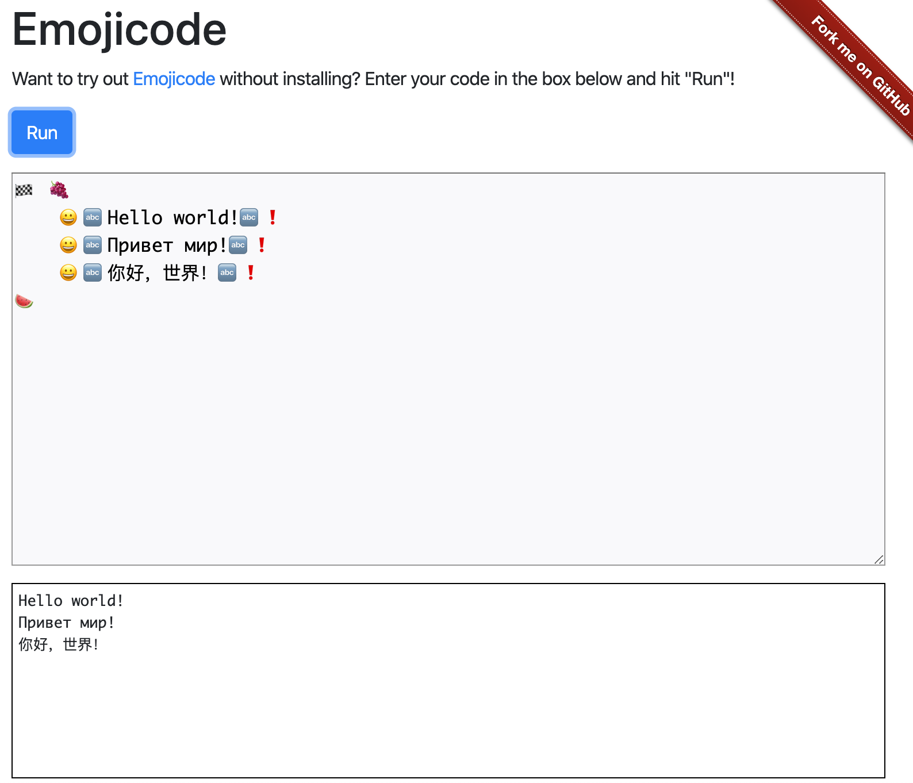

# Emojicode Playground

A web playground for the [Emojicode language](https://www.emojicode.org/).

It currently compiles version 0.8.4 of the language.

You can try out a live example at [https://emojicode.telliott.io](https://emojicode.telliott.io).

## Running

You can run the Emojicode Playground locally with Docker Compose.

Assuming you have the following prerequisites:

* Make
* [Go 1.13+](https://golang.org/)
* [Docker](https://www.docker.com/) (with Docker Compose)

You can run the server locally with the command:

    $ make compose

## Testing

Go packages below the `pkg` directory have unit tests that rely on a local instance of Docker.

These tests will time out if you don't have a local copy of the expected emojicode Docker image. You can download it with this command:

    $ docker pull theothertomelliott/emojicode:0.8.4